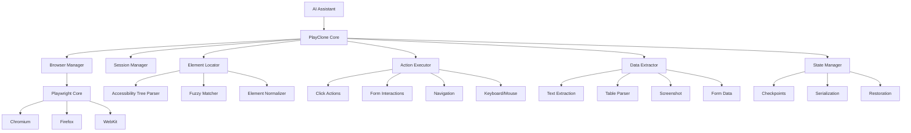
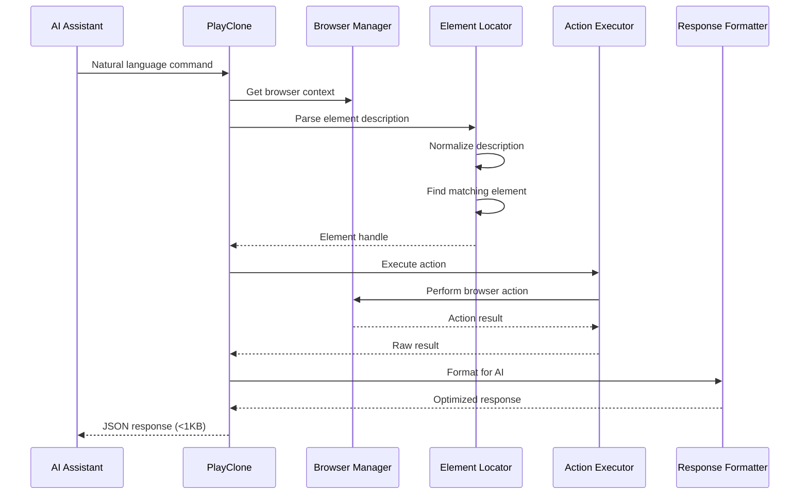
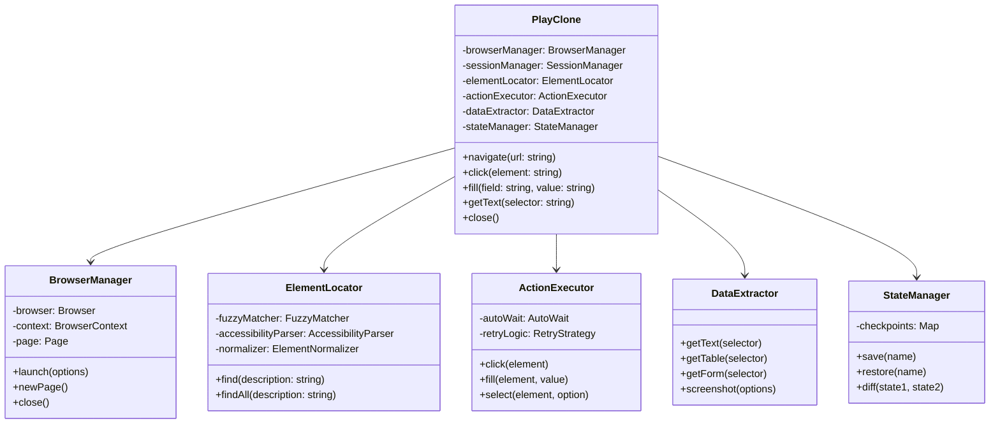
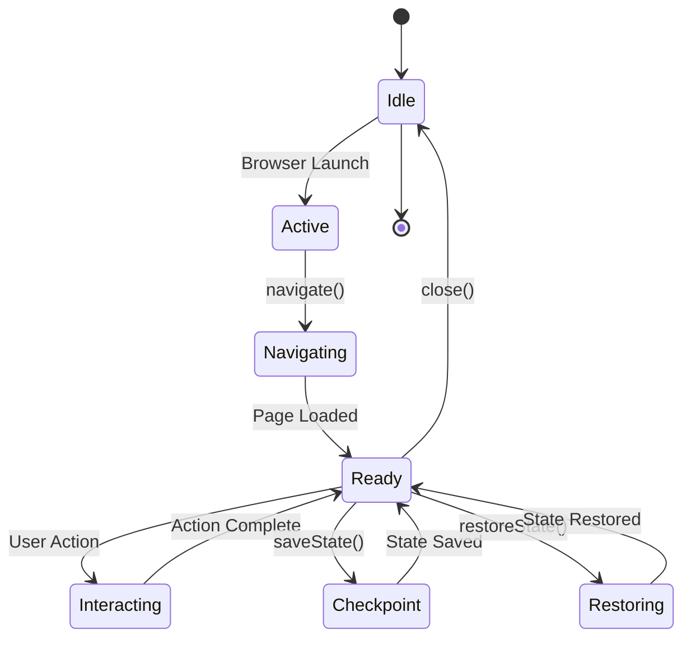
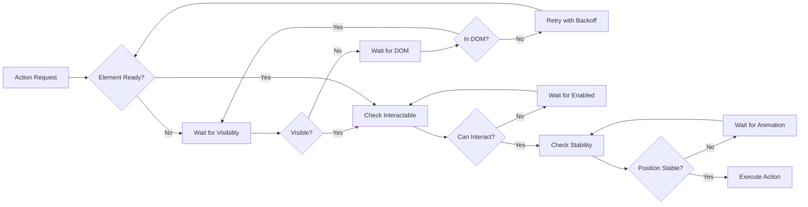
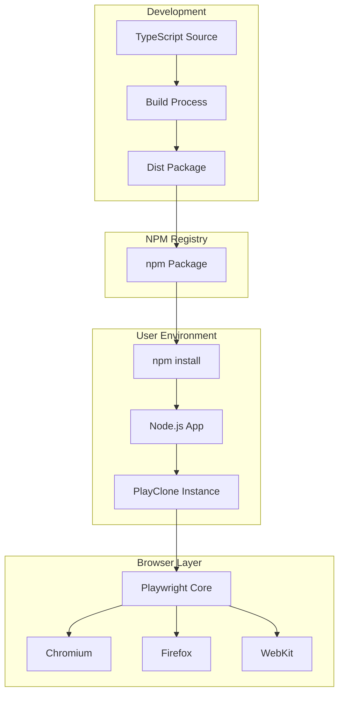
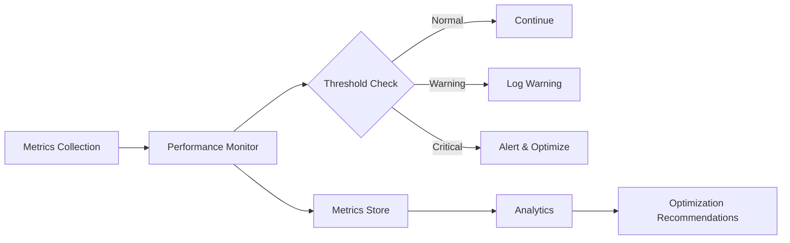
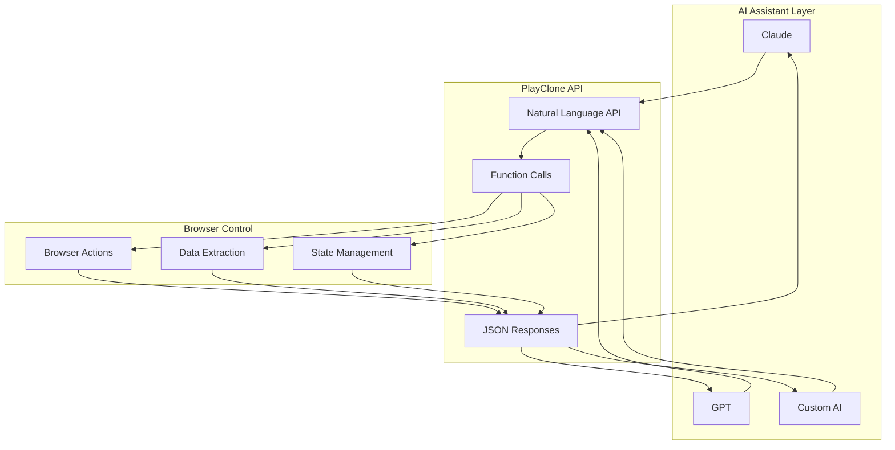
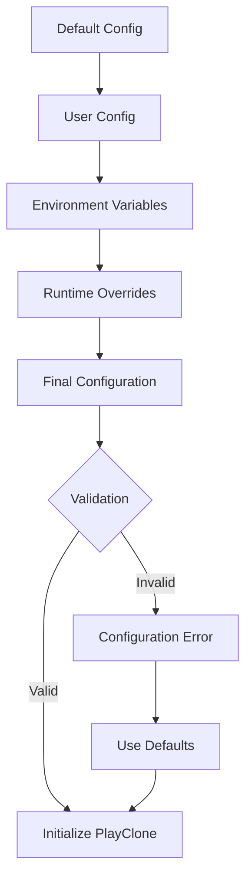
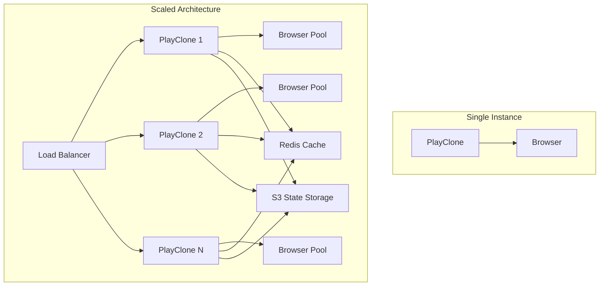

# PlayClone Architecture

## Overview

PlayClone is a browser automation framework designed specifically for AI assistants, providing a natural language interface to control web browsers without requiring code generation.

## High-Level Architecture



## Component Architecture

### Core Components

```
┌──────────────────────────────────────────────────────────┐
│                     PlayClone Core                        │
├──────────────────────────────────────────────────────────┤
│  ┌─────────────┐  ┌─────────────┐  ┌─────────────┐     │
│  │   Browser   │  │   Session   │  │   Response  │     │
│  │   Manager   │  │   Manager   │  │  Formatter  │     │
│  └─────────────┘  └─────────────┘  └─────────────┘     │
│                                                          │
│  ┌─────────────┐  ┌─────────────┐  ┌─────────────┐     │
│  │   Element   │  │   Action    │  │     Data    │     │
│  │   Locator   │  │  Executor   │  │  Extractor  │     │
│  └─────────────┘  └─────────────┘  └─────────────┘     │
│                                                          │
│  ┌─────────────┐  ┌─────────────┐  ┌─────────────┐     │
│  │    State    │  │    Error    │  │    Retry    │     │
│  │   Manager   │  │   Handler   │  │    Logic    │     │
│  └─────────────┘  └─────────────┘  └─────────────┘     │
└──────────────────────────────────────────────────────────┘
```

### Data Flow



## Module Structure

```
playclone/
├── src/
│   ├── core/
│   │   ├── PlayClone.ts         # Main class
│   │   ├── BrowserManager.ts    # Browser lifecycle
│   │   ├── SessionManager.ts    # Session handling
│   │   └── ResponseFormatter.ts # AI-optimized responses
│   │
│   ├── element/
│   │   ├── ElementLocator.ts    # Element finding
│   │   ├── FuzzyMatcher.ts      # Natural language matching
│   │   ├── AccessibilityTree.ts # A11y tree parsing
│   │   └── ElementNormalizer.ts # Description normalization
│   │
│   ├── actions/
│   │   ├── ActionExecutor.ts    # Action orchestration
│   │   ├── ClickActions.ts      # Click operations
│   │   ├── FormActions.ts       # Form interactions
│   │   ├── NavigationActions.ts # Page navigation
│   │   └── KeyboardActions.ts   # Keyboard/mouse
│   │
│   ├── extraction/
│   │   ├── DataExtractor.ts     # Data extraction
│   │   ├── TextExtractor.ts     # Text content
│   │   ├── TableParser.ts       # Table data
│   │   └── FormExtractor.ts     # Form state
│   │
│   ├── state/
│   │   ├── StateManager.ts      # State management
│   │   ├── Checkpoint.ts        # State snapshots
│   │   ├── Serializer.ts        # State persistence
│   │   └── StateComparator.ts   # State diffing
│   │
│   ├── error/
│   │   ├── ErrorTypes.ts        # Error definitions
│   │   ├── ErrorHandler.ts      # Error handling
│   │   ├── RetryStrategy.ts     # Retry logic
│   │   └── ErrorReporter.ts     # AI-friendly errors
│   │
│   ├── utils/
│   │   ├── AutoWait.ts          # Smart waiting
│   │   ├── TimeoutManager.ts    # Timeout handling
│   │   ├── Logger.ts            # Logging
│   │   └── Helpers.ts           # Utility functions
│   │
│   └── index.ts                 # Main export
│
├── tests/                       # Test files
├── examples/                    # Usage examples
└── docs/                       # Documentation
```

## Class Hierarchy



## Natural Language Processing Pipeline

```
Input: "click the blue submit button at the bottom"
                    │
                    ▼
        ┌──────────────────────┐
        │  Element Normalizer   │
        └──────────────────────┘
                    │
    Extracts: color="blue", action="click",
    text="submit", position="bottom", type="button"
                    │
                    ▼
        ┌──────────────────────┐
        │   Fuzzy Matcher       │
        └──────────────────────┘
                    │
    Scores elements based on attributes
                    │
                    ▼
        ┌──────────────────────┐
        │ Accessibility Parser  │
        └──────────────────────┘
                    │
    Checks ARIA labels, roles
                    │
                    ▼
        ┌──────────────────────┐
        │   Element Selector    │
        └──────────────────────┘
                    │
    Returns best matching element
                    │
                    ▼
           Element Handle
```

## State Management Flow



## Error Handling Strategy

```
                Error Occurs
                     │
                     ▼
            ┌─────────────────┐
            │ Error Classifier │
            └─────────────────┘
                     │
        ┌────────────┼────────────┐
        ▼            ▼            ▼
   Retryable    Recoverable   Fatal
        │            │            │
        ▼            ▼            ▼
   ┌─────────┐  ┌─────────┐  ┌─────────┐
   │  Retry  │  │ Recover │  │  Report │
   │  Logic  │  │Strategy │  │  Error  │
   └─────────┘  └─────────┘  └─────────┘
        │            │            │
        ▼            ▼            ▼
   Try Again    Alternative    AI Response
                  Approach      with Help
```

## Auto-Wait Mechanism



## Browser Pool Architecture

```
┌────────────────────────────────────────────┐
│              Browser Pool                   │
├────────────────────────────────────────────┤
│                                            │
│   ┌──────────┐  ┌──────────┐  ┌──────────┐│
│   │ Browser  │  │ Browser  │  │ Browser  ││
│   │Instance 1│  │Instance 2│  │Instance 3││
│   │  (idle)  │  │ (active) │  │  (idle)  ││
│   └──────────┘  └──────────┘  └──────────┘│
│                                            │
│   ┌────────────────────────────────────┐  │
│   │         Pool Manager                │  │
│   ├────────────────────────────────────┤  │
│   │ • Lifecycle Management             │  │
│   │ • Health Monitoring                │  │
│   │ • Resource Allocation              │  │
│   │ • Cleanup & Recovery               │  │
│   └────────────────────────────────────┘  │
└────────────────────────────────────────────┘
```

## Response Optimization Pipeline

```
    Raw Browser Response (10KB+)
              │
              ▼
    ┌─────────────────────┐
    │   Data Extraction   │
    └─────────────────────┘
              │
              ▼
    ┌─────────────────────┐
    │  Remove Redundancy  │
    └─────────────────────┘
              │
              ▼
    ┌─────────────────────┐
    │   Compress Keys     │
    └─────────────────────┘
              │
              ▼
    ┌─────────────────────┐
    │  Truncate if Needed │
    └─────────────────────┘
              │
              ▼
    AI-Optimized Response (<1KB)
```

## Deployment Architecture



## Security Architecture

```
┌──────────────────────────────────────┐
│         Security Layer                │
├──────────────────────────────────────┤
│                                      │
│  ┌──────────────────────────────┐   │
│  │   Input Validation           │   │
│  │   • URL Sanitization         │   │
│  │   • Selector Validation      │   │
│  │   • Script Injection Block   │   │
│  └──────────────────────────────┘   │
│                                      │
│  ┌──────────────────────────────┐   │
│  │   Sandbox Execution          │   │
│  │   • Isolated Contexts        │   │
│  │   • Limited Permissions      │   │
│  │   • Resource Limits          │   │
│  └──────────────────────────────┘   │
│                                      │
│  ┌──────────────────────────────┐   │
│  │   Data Protection            │   │
│  │   • No Credential Storage    │   │
│  │   • Encrypted Communication  │   │
│  │   • Session Isolation        │   │
│  └──────────────────────────────┘   │
└──────────────────────────────────────┘
```

## Performance Monitoring



## Testing Architecture

```
┌─────────────────────────────────────────┐
│            Test Suite                   │
├─────────────────────────────────────────┤
│                                         │
│  Unit Tests        Integration Tests    │
│  ┌──────────┐      ┌──────────────┐   │
│  │ Element  │      │   Browser     │   │
│  │ Locator  │      │   Actions     │   │
│  └──────────┘      └──────────────┘   │
│  ┌──────────┐      ┌──────────────┐   │
│  │  Fuzzy   │      │     Data      │   │
│  │ Matcher  │      │  Extraction   │   │
│  └──────────┘      └──────────────┘   │
│                                         │
│  E2E Tests         Performance Tests    │
│  ┌──────────┐      ┌──────────────┐   │
│  │ Complete │      │   Load Test   │   │
│  │Workflows │      │   Benchmarks  │   │
│  └──────────┘      └──────────────┘   │
└─────────────────────────────────────────┘
```

## AI Integration Points



## Memory Management

```
┌──────────────────────────────────────┐
│         Memory Manager                │
├──────────────────────────────────────┤
│                                      │
│  Browser Instances                   │
│  ┌────────────────────────────┐     │
│  │ Active: 3 | Idle: 2        │     │
│  │ Memory: 512MB / 1GB limit  │     │
│  └────────────────────────────┘     │
│                                      │
│  Page Cache                          │
│  ┌────────────────────────────┐     │
│  │ Cached Pages: 10           │     │
│  │ Cache Size: 50MB           │     │
│  └────────────────────────────┘     │
│                                      │
│  State Storage                       │
│  ┌────────────────────────────┐     │
│  │ Checkpoints: 5             │     │
│  │ Storage: 10MB              │     │
│  └────────────────────────────┘     │
│                                      │
│  Garbage Collection                  │
│  ┌────────────────────────────┐     │
│  │ Next GC: 5 min             │     │
│  │ Collected: 200MB           │     │
│  └────────────────────────────┘     │
└──────────────────────────────────────┘
```

## Configuration Flow



## Future Architecture Considerations

### Planned Enhancements

1. **Plugin System**
   - Custom action plugins
   - Element matcher plugins
   - Data extractor plugins

2. **Distributed Execution**
   - Multi-machine browser pools
   - Load balancing
   - Fault tolerance

3. **Advanced AI Features**
   - Computer vision for element detection
   - ML-based element prediction
   - Adaptive learning from usage patterns

4. **Performance Optimizations**
   - WebAssembly modules for critical paths
   - Native bindings for performance
   - GPU acceleration for vision tasks

### Scalability Considerations



## Summary

PlayClone's architecture is designed with the following principles:

1. **AI-First**: Natural language interface, token-optimized responses
2. **Modular**: Clear separation of concerns, pluggable components
3. **Robust**: Comprehensive error handling, retry strategies
4. **Performant**: Connection pooling, smart caching, lazy loading
5. **Maintainable**: Clear structure, extensive documentation
6. **Scalable**: Designed for both single-instance and distributed use

The architecture enables AI assistants to control browsers naturally while maintaining performance, reliability, and security.